# SQL Project - Data Analysis
## Box office performance of DC and Marvel superhero movies

### Tools:
+ SQL
+ SQL Server (Database)
+ SSMS (SQL Server Management Studio)
+ MS Excel
+ Git & Github
+ VS Code Editor

### About Dataset:
The dataset comprises box office data and supplemental information for all theatrically released films adapted from Marvel Comics and DC Comics core superhero universes. TV specials and other projects that did not receive a wide theatrical release are not included.

#### Available Column and its Explanation:

+ **Film** - The film's title in the U.S.
+ **U.S. release date** - The first day it premiered in the U.S.	 
+ **Box office gross Domestic (U.S. and Canada)** -  Total earnings in the U.S. and Canada	 
+ **Box office gross Other territories** - Total earnings outside the U.S. and Canada	 
+ **Box office gross Worldwide** - Total earnings globally	 
+ **Budget** - Production cost	
+ **MCU** - Indicates if the film is part of the Marvel Cinematic Universe
+ **Phase**	- Denotes the phase of the MCU the film belongs to
+ **Distributor** - The studio distributing the film in the U.S.	
+ **MPAA Rating** - Age rating by the Motion Picture Association. The current available classifications from the MPA are:
    + G (General Audiences)
    + PG (Parental Guidance Suggested)
    + PG-13 (Parents Strongly Cautioned)
    + R (Restricted)
    + NC-17 (No on 17 and under admitted)
+ **Length** - Duration of the U.S. theatrical cut
+ **Minutes** - Same as above but presented only in minutes	
+ **Franchise	Character Family** - Grouping based on the film's main characters	
+ **Domestic%** - Percentage of worldwide gross from U.S. and Canada	
+ **Gross to Budget** - Ratio of worldwide gross to budget.	
+ **Rotten Tomatoes Critic Score** - Average score from professional critics on Rotten Tomatoes	
+ **Male/Female-led** - Gender of the film's lead.	
+ **Year** - Theatrical release year in the U.S.	 
+ **Inflation Adjusted Worldwide Gross** - Total earnings adjusted for inflation	 
+ **Inflation Adjusted Budget** - Production budget adjusted for inflation	 
+ **2.5x prod** - Production budget multiplied by 2.5	
+ **Break Even** - Indicates if the film reached profitability based on the 2.5x rule

[Read more](https://www.kaggle.com/datasets/mdtoomey/box-office-of-dc-and-marvel-superhero-movies) for detailed explanation. 

[click here](./dc_marvel_movie_performance.csv) to show the dataset and download it to use.

> Original data source is Kaggle. [Click here](https://www.kaggle.com/datasets/mdtoomey/box-office-of-dc-and-marvel-superhero-movies/download?datasetVersionNumber=1) to download.

### Questions for analysis to measure Box-Office performance: 
1. List all DC superhero movies with their U.S. release dates and worldwide box office gross.

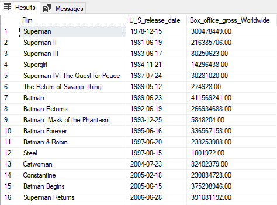

2. Calculate the total box office gross worldwide for all Marvel movies.

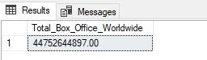

3. Find the average length of DC superhero movies.

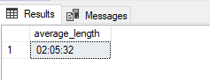

4. Retrieve the top 5 highest-grossing DC movies in the U.S. and Canada.

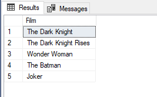

5. List all Marvel Phase 3 movies.

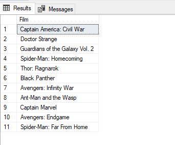

6. Find the movie with the highest budget among all superhero movies.

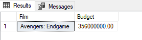

7. Calculate the percentage of domestic box office gross for each Marvel movie.

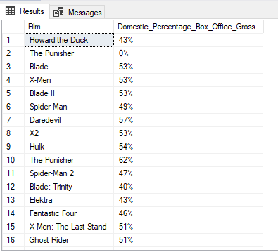

8. Find the movie with the highest Rotten Tomatoes critic score.

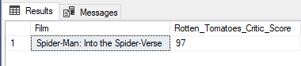

9. List all DC movies released after 2010.

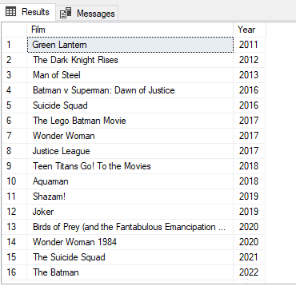

10. Find the average gross to budget ratio for Marvel Phase 2 movies.

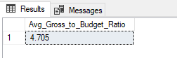

11. Retrieve the top 5 highest-grossing movies for each distributor.

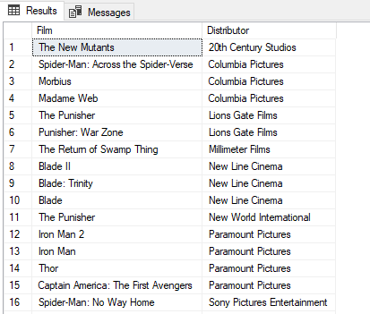

12. List all movies with a budget higher than $200 million.

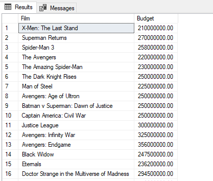

13. Find the average length of movies in each MPAA rating category.

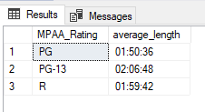

14. Calculate the total worldwide gross for each year.

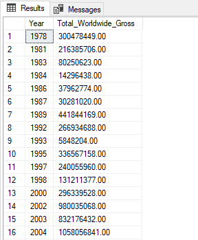

15. List all Marvel movies led by a female character.

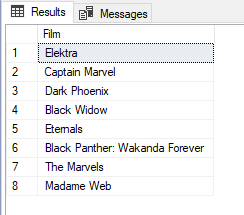

16. Find the movie with the highest inflation-adjusted worldwide gross.

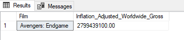

17. Retrieve the top 3 movies with the highest ROI (Return on Investment).

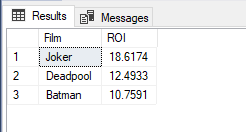

18. List all Marvel Phase 1 movies with their budgets and lengths.

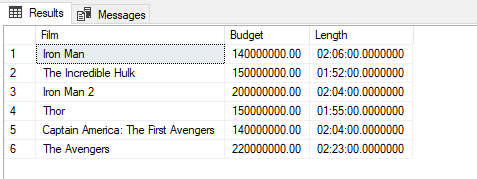

19. Find the distribution of MPAA ratings for DC movies.

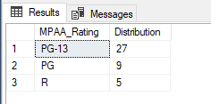

20. Calculate the average inflation-adjusted budget for DC Phase 2 movies.

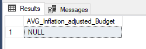

21. Retrieve the oldest DC movie in the dataset.

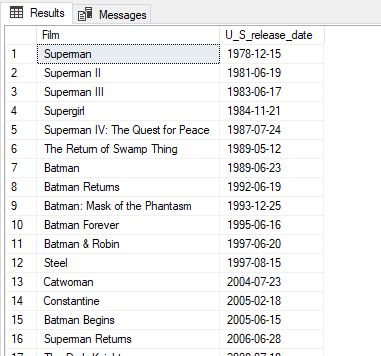

22. Find the movie with the highest box office gross in other territories.

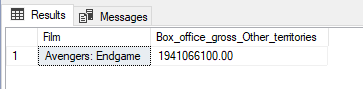

23. Calculate the total box office gross for each franchise.

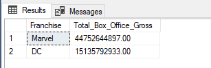

24. Retrieve the top 3 movies with the lowest Rotten Tomatoes critic scores.

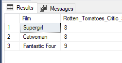

25. List all movies released before 2000.

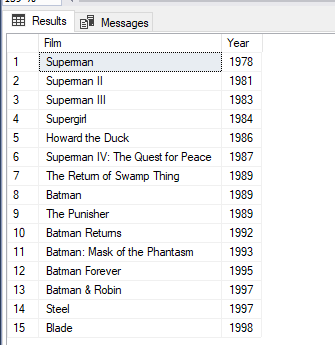

26. Find the average length of movies for each character family.

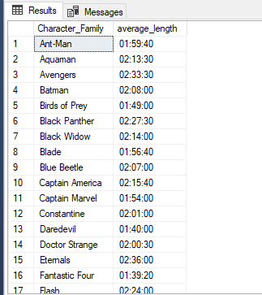

27. Calculate the percentage of movies with a budget higher than $100 million.

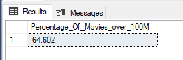

28. Retrieve the top 3 highest-grossing movies with a PG-13 rating.

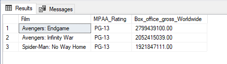

29. List all movies with a break-even point less than 2.5x their budget.

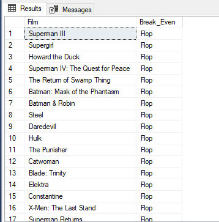

### SQL Query:
[click here](./Box-Office-Performance-SQLQuery.sql) to see the all SQL queries for each question asked here.

> Note: The Questions are provided by <a href="https://www.linkedin.com/in/sushant-singh-chauhan-/" target="_blank">Sushant Singh Chauhan</a>. He posted on Linkedin. Check it <a href="https://www.linkedin.com/feed/update/urn:li:activity:7180606465416593409?updateEntityUrn=urn%3Ali%3Afs_updateV2%3A%28urn%3Ali%3Aactivity%3A7180606465416593409%2CFEED_DETAIL%2CEMPTY%2CDEFAULT%2Cfalse%29" target="_blank">here</a>.